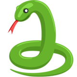

# DeepSnakes

In this project, we will use deep learning to classify snakes. We begin distinguishing between pythons (because... why not?) and rattlesnakes.

Already available:

1. Routine to download snake images from the web.
2. Routine to resize and concatenate images on an numpy ndarray [n_images, width, height, channels].
3. Logistic Regression classification of snakes analysis.
4. Shallow neural networks analysis.

Coming next:

5. Convolutional neural networks analysis.

In the future:

6. Deep Learning for multiclass classification (add other snake species to the problem).
7. End-to-end DL approach to distinguishing venomous from non venomous snakes.

Warnings:

 - Contains pictures of snakes, viewer discretion is advised. 
 - Don't Bear Grills yourself into the wild to photograph snakes without adult supervision.
 - This is an educational demonstrative for fun project. There is no guarantee involved.
